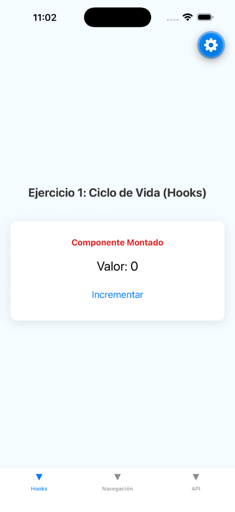
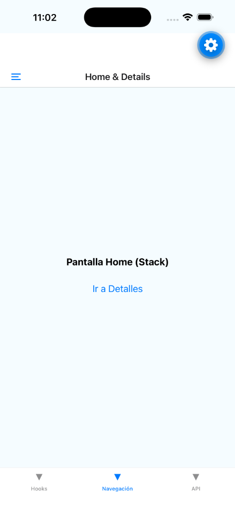
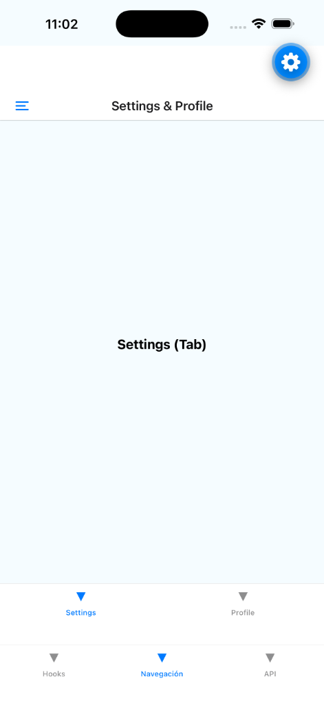
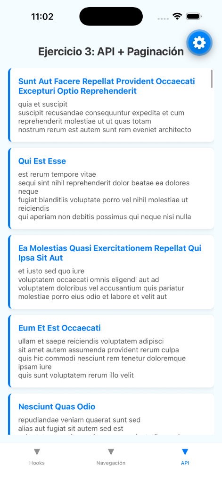

# Evidencia de Implementación
## Taller de Software Móvil (S6-S7)

**Estudiante:** Ever  
**Proyecto:** Ejercicios Integradores S6-S7  

---

  <h2>1. Ejercicio Integrador: Hooks y Ciclo de Vida</h2>
  
Se implementó un contador y un temporizador utilizando <code>useState</code> y <code>useEffect</code>. El sistema gestiona el ciclo de vida del componente, limpiando procesos al desmontar para optimizar el rendimiento.

  
  

    
    
Captura 1.1: Estado inicial y montaje del componente.

  

  

    
    
Captura 1.2: Actualización de estado tras interacción.

  

  <h2>2. Ejercicio Integrador: Navegación Combinada</h2>
  
Se integraron tres patrones de navegación: <b>Drawer</b> (menú lateral), <b>Stack</b> (flujo de pantallas) y <b>Tab</b> (pestañas internas), utilizando un árbol de navegación independiente.

  

    
    
Captura 2.1: Navegación tipo Stack (Home & Details).

  

  

    
    
Captura 2.2: Menú lateral Drawer desplegado.

  

  

    
    
Captura 2.3: Navegación interna por pestañas.

  

  <h2>3. Ejercicio Integrador: API REST y Paginación</h2>
  
Consumo de datos asíncronos con <b>Axios</b>. La interfaz utiliza un <code>FlatList</code> optimizado con scroll infinito y pull-to-refresh.

  

    
    
Captura 3.1: Renderizado de datos desde la API pública.

  

---

Fin del documento de evidencia

