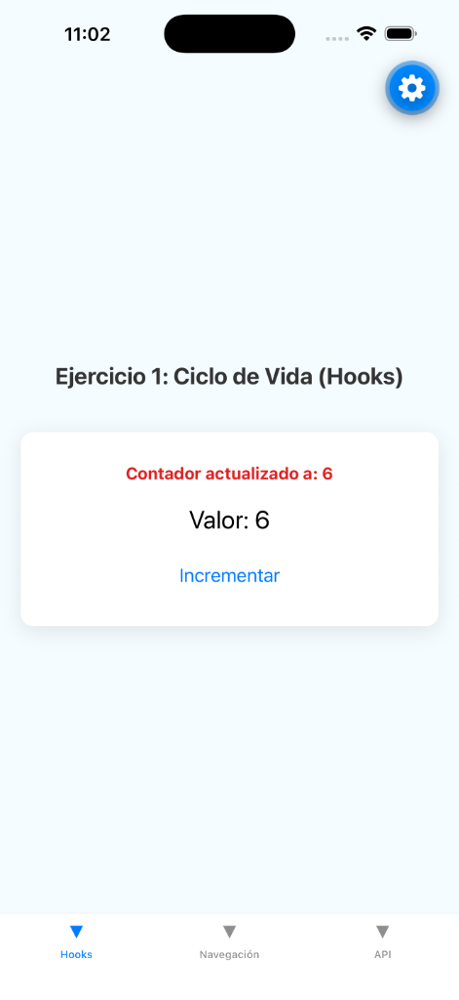
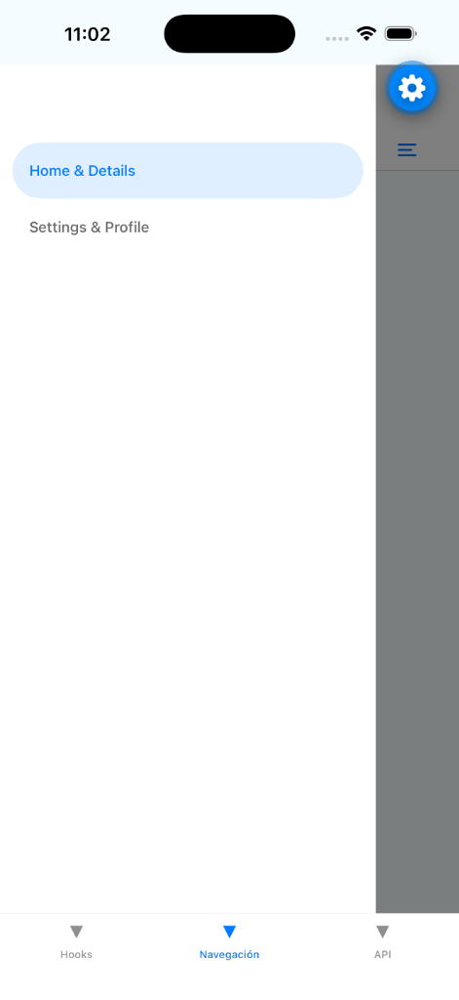

# Semana 6 y 7: Ejercicios Integradores

Este módulo contiene la implementación de tres ejercicios prácticos fundamentales para el desarrollo móvil en React Native. Se cubren conceptos de ciclo de vida, navegación compleja y consumo de APIs con optimización de rendimiento.

---

### 🛠 1. Hooks y Ciclo de Vida
Se utiliza `useState` y `useEffect` para gestionar un contador y un temporizador. El sistema registra eventos de montaje, actualización y desmontaje en la consola, asegurando la limpieza de procesos al salir de la vista.

| Estado Inicial | Actualización de Estado |
| :---: | :---: |
|  |  |
| *Captura: Montaje inicial* | *Captura: Incremento de contador* |

---

### 🗺 2. Navegación Combinada
Implementación de una arquitectura de navegación anidada profesional: **Drawer** como contenedor raíz, que integra un **Stack** para flujos lineales y un **Tab Navigator** para secciones secundarias.

| Stack Navigator | Menu Drawer | Tab Navigator |
| :---: | :---: | :---: |
|  |  |  |
| *Flujo Home/Detalles* | *Acceso lateral* | *Ajustes y Perfil* |

---

### 📡 3. API REST e Infinite Scroll
Consumo asíncrono de datos con **Axios** desde JSONPlaceholder. La interfaz implementa un `FlatList` con scroll infinito, detectando el final de la lista para cargar nuevos datos automáticamente (Paginación).

| Consumo de Datos (API) |
| :---: |
|  |
| *Captura: Lista con carga dinámica* |

---
*Documentación de evidencia técnica - 2026*
